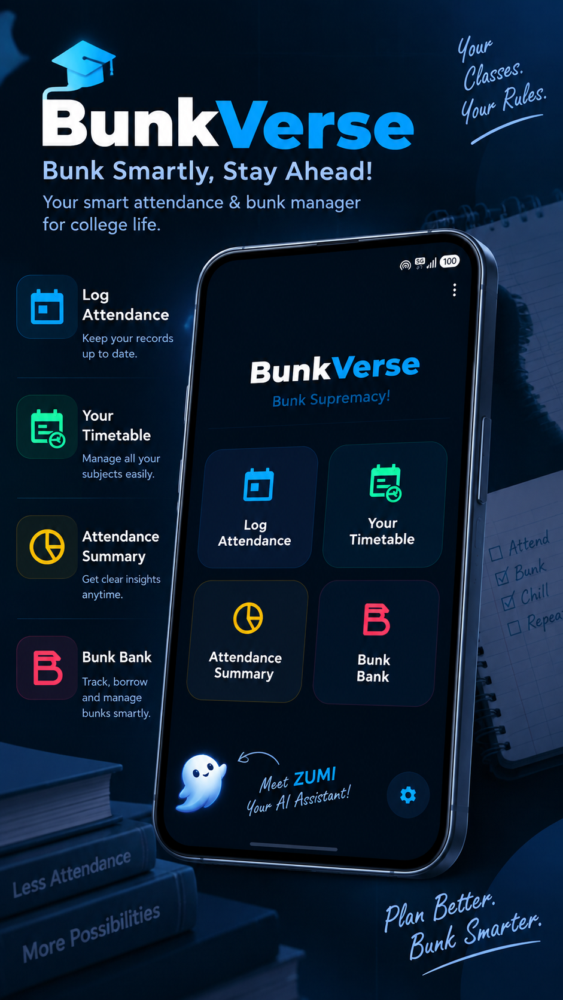
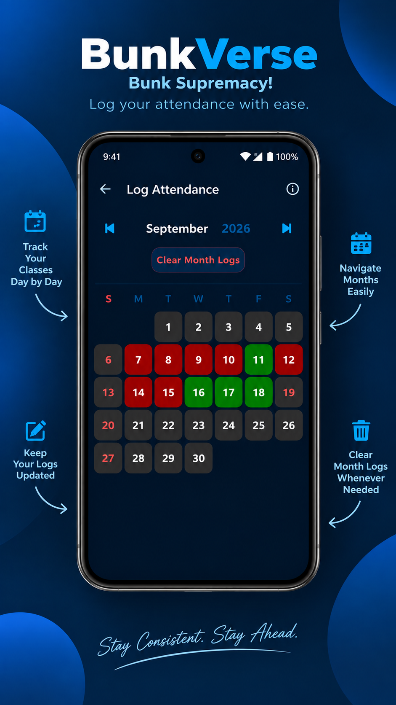
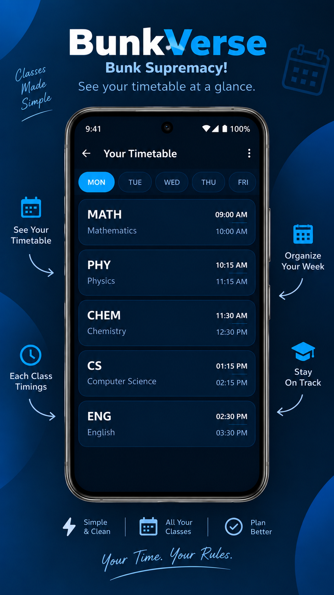
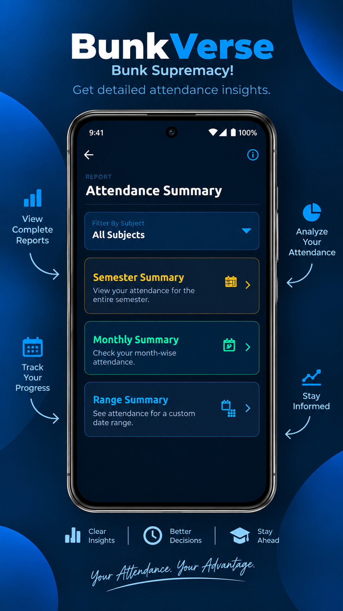
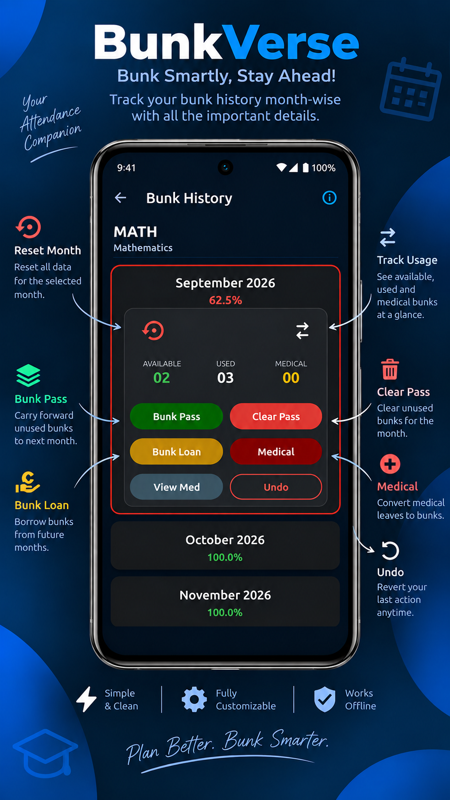

# BunkVerse

### Smart Attendance & Bunk Management System for Students

**The goal isn't just to bunk; it's to plan your adventures without losing your attendance.**

---

## About

BunkVerse is a student-focused attendance management application designed to make attendance tracking, analysis, and planning easier.

Instead of simply displaying an attendance percentage, BunkVerse introduces the **Bunk Bank** — a system that helps students understand how many classes they can safely miss, carry unused bunks forward, or borrow from future months when necessary.

BunkVerse is designed around the idea of **planning attendance responsibly**, giving students a clearer picture of their attendance situation without relying on manual calculations.

---

## Features

### Bunk Bank

The core system behind BunkVerse.

- Available Bunks
- Bunk Pass
- Bunk Loan
- Medical Leave
- Undo
- Ledger Reset

[View the complete Bunk Bank documentation →](docs/BUNK_BANK.md)

### Attendance Tracking

Calendar-based attendance management supporting:

- Full Day Present
- Absent
- Partial Attendance
- Date-range attendance management
- Holidays
- Examination days
- Cancelled classes
- Extra classes

### Timetable & Subject Management

- Flexible weekly timetable
- Automatic class timing calculation
- Per-day lunch breaks
- Custom subject short codes
- Weekday-to-Saturday timetable copying
- Custom Saturday schedules
- Weekend class support

### Reports & Analytics

Generate attendance reports for:

- Entire semester
- Individual months
- Custom date ranges
- All subjects
- Individual subjects

Attendance status is represented as:

- 🟢 **Safe** — 75% or above
- 🟡 **Caution** — 60–74%
- 🔴 **Danger** — Below 60%

### Privacy & Offline Storage

BunkVerse follows a **local-first approach**.

Attendance, timetable, subject, Bunk Bank, and application settings are stored locally on the device.

There is no account registration or cloud-based attendance tracking.

### Backup

Application data can be exported as:

`BunkVerse_Backup.csv`

The backup can contain subjects, attendance records, timetable data, Bunk Bank information, and application settings.

---

## Screenshots

### Homepage

### Attendance Calendar

### Timetable

### Reports & Analytics

### Bunk Bank

---

## Technology Stack

| Component | Technology |
|---|---|
| Language | Java |
| Platform | Android |
| Local Database | Room / SQLite |
| UI | Material Components |
| Serialization | Gson |
| Animations | Lottie |
| Tutorial | WebView |
| Advertising | Google AdMob |
| Minimum SDK | API 24 |
| Target SDK | API 36 |

[View the architecture documentation →](docs/ARCHITECTURE.md)

---

## Project Information

| Property | Details |
|---|---|
| Project | BunkVerse |
| Developer | Amogh V P |
| Creator Name | AmoghVP |
| Current Version | 1.6 |
| Build | 6 |
| Package | `com.amoghvp.bunkverse` |
| Minimum SDK | API 24 |
| Target SDK | API 36 |
| Platform | Android |
| Language | Java |
| License | Proprietary / Private |

---

## Source Code

The BunkVerse application source code is **proprietary and is not publicly available**.

This repository is a **project showcase and documentation repository**.

It may contain:

- Feature documentation
- Architecture information
- Screenshots
- Visual assets
- Development information
- Release information

It does not contain:

- Application source code
- Android Studio project files
- Signing keys
- Private credentials
- API secrets
- Production databases
- Other confidential development resources

The BunkVerse source code remains privately maintained by the developer.

---

## Project Status

**Published on Google Play**

BunkVerse is an actively maintained project and may receive future updates, improvements, and additional platform support.

---

## Philosophy

BunkVerse isn't designed to encourage students to blindly skip classes.

It is designed to help students **understand their attendance, calculate their available flexibility, and make informed decisions**.

> **Track smarter. Plan better. Bunk responsibly.**

---

## Developer

### Amogh V P

**AmoghVP**

BunkVerse is an independently developed student-focused application created to solve a practical problem with attendance management and planning.

The project covers the complete development cycle:

**Concept → UI/UX → Development → Database Architecture → Testing → Deployment → Google Play Publishing**

---

## BunkVerse

**Smart attendance. Smarter planning.**

